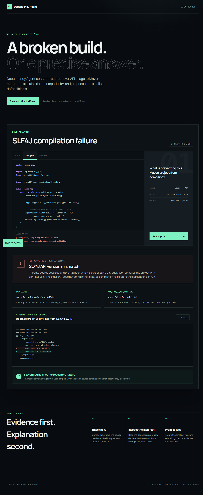

# Dependency Agent

Dependency Agent is a focused portfolio prototype that explains a real Maven
dependency failure with concrete evidence and a minimal patch.

The bundled Java source uses `org.slf4j.spi.LoggingEventBuilder`, an API from
SLF4J 2.x. The broken POM pins `slf4j-api` to 1.6.6. Dependency Agent connects
those two facts, explains why compilation fails, and proposes the repository's
verified 2.0.17 fix.



## What the demo proves

- Reads Java source and Maven XML rather than relying on a generated guess.
- Identifies the incompatible API and dependency versions.
- Returns the exact evidence supporting the diagnosis.
- Produces the smallest relevant unified diff.
- Compares the change with the working repository fixture.

The public experience is intentionally curated: it does not accept uploads or
execute arbitrary repositories.

## Run locally

Requires Python 3.11 or newer and [uv](https://docs.astral.sh/uv/).

```bash
uv sync --extra dev
uv run uvicorn dependency_agent.web:app --reload
```

Open `http://127.0.0.1:8000`.

The same analyser can be used from the terminal:

```bash
uv run dependency-agent analyse maven/demo-app/pom_that_do_not_work.xml
```

For structured output, add `--json`.

## Test

```bash
uv run pytest
```

## Deploy

The repository includes a small production `Dockerfile`. Any container host can
run it by exposing the `PORT` environment variable.

The public portfolio deployment is packaged as a self-contained edge worker
from the same analyser output:

```bash
uv run python scripts/build_worker.py
```

## Scope and limitations

This is an evidence-led demonstration, not a general dependency resolver. The
MVP recognises the bundled SLF4J scenario only. It does not currently resolve
transitive graphs, inspect remote repositories, or invoke a language model.

Those constraints are deliberate: the demo stays fast, reproducible, safe, and
honest about what it can infer.

## Licence

[MIT](LICENSE)
